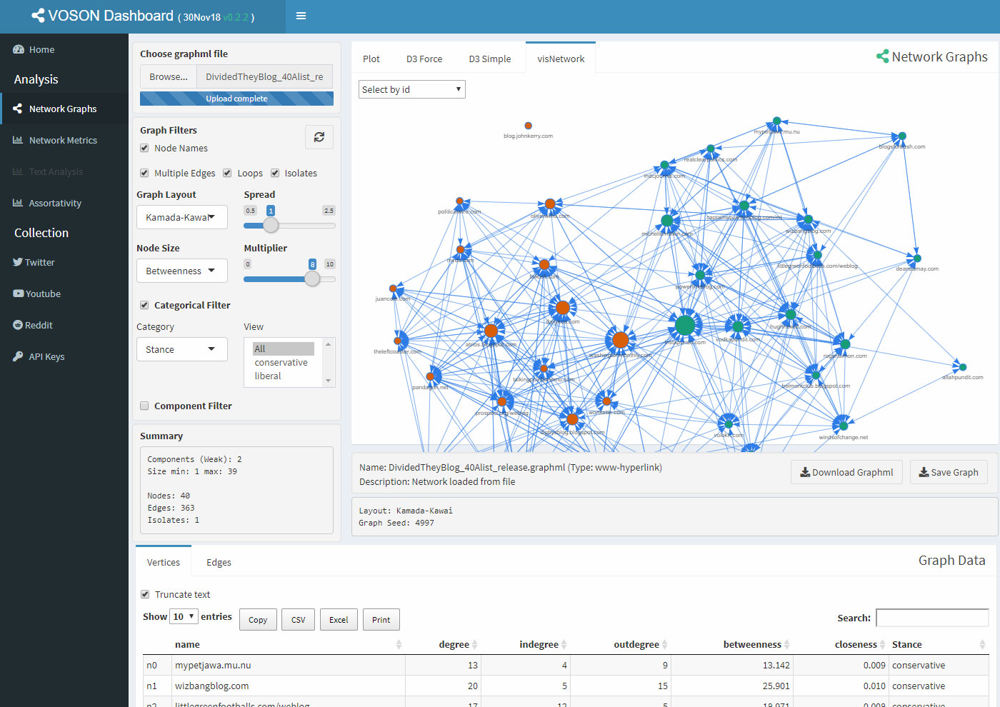

# VOSONDash

`VOSONDash` is an interactive [R Shiny](https://shiny.rstudio.com/) web application for the visualisation and analysis of social network data. The app has a dashboard layout with sections for visualising and manipulating network graphs, performing text analysis, displaying network metrics and the collection of network data using the [vosonSML](https://github.com/vosonlab/vosonSML) R package.

## Installation

Installation simply requires [downloading](https://github.com/vosonlab/VOSONDash/releases/download/v0.3.8/VOSONDash-0.3.8.zip) the `VOSONDash` files and unzipping them to a folder. The app is opened in [RStudio](https://www.rstudio.com/) by either creating a new project using the `VOSONDash` directory or navigating to the folder using the RStudio File browser tab.

The latest `VOSONDash` can be downloaded from the [VOSON lab](https://github.com/vosonlab) on github using the following link: 
https://github.com/vosonlab/VOSONDash/releases/download/v0.3.8/VOSONDash-0.3.8.zip

## Getting started

The app can be run by typing `runApp()` in the RStudio Console (optionally with a path `appDir = '~/my/voson/dash/folder/path/'`) or alternatively by clicking on the `Run App` button that appears in the top right of the RStudio file viewer frame when either the `ui.R` or `server.R` files are open.

### VOSONDash app interface

`VOSONDash` features an intuitive web interface with a section for analysis of graph data in `graphml` format and a section for collecting social media data with [vosonSML](https://github.com/vosonlab/vosonSML).

## Special thanks

This application would not be possible without key packages by other authors in the R community, particularly the [shiny](https://github.com/rstudio/shiny), [shinydashboard](https://github.com/rstudio/shinydashboard), [DT](https://github.com/rstudio/DT) and [shinyjs](https://github.com/daattali/shinyjs) packages. Graph visualisations created with [igraph](https://github.com/igraph/rigraph), [networkD3](https://github.com/christophergandrud/networkD3) and [visNetwork](https://github.com/datastorm-open/visNetwork), and text analysis with support from [tm](https://cran.r-project.org/web/packages/tm/index.html), [SnowballC](https://cran.r-project.org/web/packages/SnowballC/index.html) and [wordcloud](https://cran.r-project.org/web/packages/wordcloud/index.html) packages.
