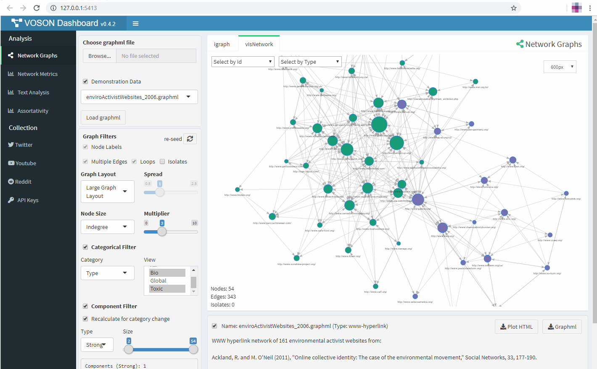
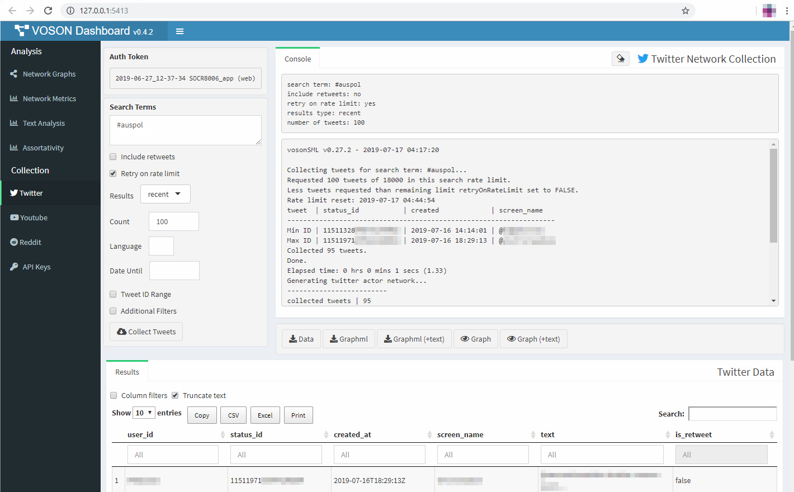

# VOSONDash


[](https://CRAN.R-project.org/package=VOSONDash)


`VOSONDash` is an interactive [R Shiny](https://shiny.rstudio.com/) web application for the visualisation and analysis of social network data. The app has a dashboard layout with sections for visualising and manipulating network graphs, performing text analysis, displaying network metrics and the collection of network data using the [vosonSML](https://github.com/vosonlab/vosonSML) R package.

## Installation

`VOSONDash` is an R package and must be installed before the app can be run.

Install the latest Github release:
```R
install.packages("https://github.com/vosonlab/VOSONDash/releases/download/v0.4.2/VOSONDash-0.4.2.tar.gz", 
  repo = NULL, type = "source")
```

Install vosonSML from CRAN:
```R
# pending acceptance
install.packages("VOSONDash")
```

or install the latest dev version:
```R
# library(devtools)
devtools::install_github("vosonlab/VOSONDash")
```

Once the VOSON Dashboard package is installed the Shiny web application can be run from the RStudio console using the `runVOSONDash()` function.

```R
library(VOSONDash)

runVOSONDash()
```

### Running the app for the first time

When run the `VOSONDash` app will check that all of the R packages that are required to make it work are installed. It is likely that some packages will be missing and the app will print a message indicating the missing packages and a command that can be used to install them.

For example:

```R
> runVOSONDash()
=================================================
VOSONDash v0.4.0
27 Jun 2019 09:35

x86_64-apple-darwin15.6.0 
R version 3.6.0 (2019-04-26)
R shiny 1.3.2 

Home: /Users/voson_user
Encoding: native.enc 

Checking packages...
Required Packages Missing:
- visNetwork
- syuzhet
```

The missing packages can be installed using the provided package install command.

```R
Please install required packages before using VOSONDash:

install.packages(c("visNetwork","syuzhet"))
```

After installing required packages and running again the `VOSONDash` Shiny app will open up in the default web browser.

## VOSON Dashboard

`VOSONDash` features an intuitive web interface with a section for 'Analysis' of graph data in `graphml` format and a section for 'Collection' of social media data using [vosonSML](https://github.com/vosonlab/vosonSML).

### Analysis

Network and text analysis of graphml network data.  



### Collection

Section for managing Social Media API keys and graphical interfaces for collecting twitter, youtube and reddit data.



## Special thanks

This application would not be possible without key packages by other authors in the R community, particularly the [shiny](https://github.com/rstudio/shiny), [shinydashboard](https://github.com/rstudio/shinydashboard), [DT](https://github.com/rstudio/DT) and [shinyjs](https://github.com/daattali/shinyjs) packages. Graph visualisations created with [igraph](https://github.com/igraph/rigraph) and [visNetwork](https://github.com/datastorm-open/visNetwork), and text analysis with support from [tm](https://cran.r-project.org/web/packages/tm/index.html), [SnowballC](https://cran.r-project.org/web/packages/SnowballC/index.html), [wordcloud](https://cran.r-project.org/web/packages/wordcloud/index.html) and [syuzhet](https://cran.r-project.org/web/packages/syuzhet/index.html) packages.