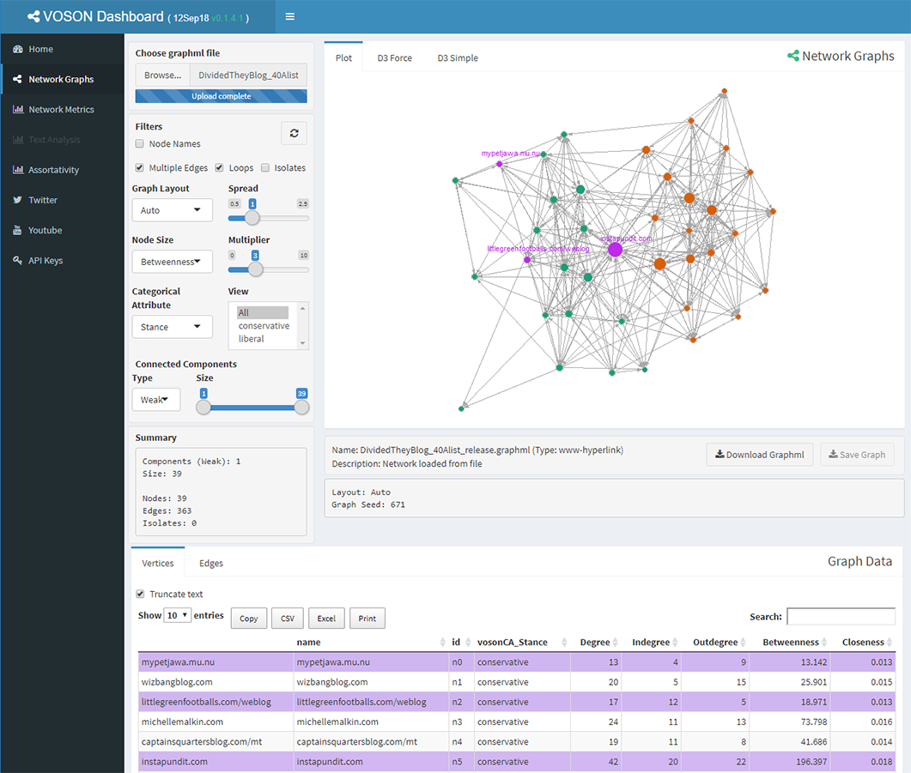

# VOSON Dashboard

## Overview

`VOSON Dashboard` is an interactive [R Shiny](https://shiny.rstudio.com/) web application for the visualisation and analysis of social network data. The app has a dashboard layout with sections for visualising and manipulating network graphs, performing text analysis, displaying network metrics and the collection of network data using the [vosonSML](https://github.com/vosonlab/vosonSML) R package.

## Installation

Installation simply requires [downloading](https://github.com/vosonlab/VOSONDash/archive/master.zip) the `VOSON Dashboard` files and unzipping them to a folder. The app is opened in [RStudio](https://www.rstudio.com/) by either creating a new project using the `VOSON Dashboard` directory or navigating to the folder using the RStudio File browser tab.

The latest `VOSON Dashboard` can be downloaded from the [VOSON lab](https://github.com/vosonlab) on github using the following link: 
https://github.com/vosonlab/VOSONDash/archive/master.zip

## Run Application

The app can be run by typing `runApp()` in the RStudio Console (optionally with a path `appDir = '~/my/voson/dash/folder/path/'`) or alternatively by clicking on the `Run App` button that appears in the top right of the RStudio file viewer frame when either the `ui.R` or `server.R` files are open.

## Features

### Network Graphs

The Network Graphs section allows the user to manipulate or filter graph data using a number of interactive network controls. Data is visualised as a network graph in the graph views and as a table of vertices and edges in the data table.

Network graph controls include filtering out vertex isolates, multi-edges, self-loops and components (by size). Graph layout, vertex size and color can also be adjusted based on network or categorical attributes. Finally, the vertices data table can be used to prune selected vertices from the graph. Modified graph will be automatically loaded into the other analysis sections and can also be saved from the network graphs section as a standalone `graphml` file.

Network data can be loaded either by the `graphml` upload control or from the `view graph` button in the network collection sections.

